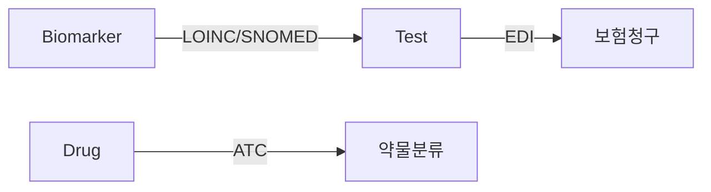

# 보유 코드 데이터 현황 - 2025년 11월 9일

## 📊 전체 요약

| 코드 시스템 | 전체 보유 | 현재 사용 | 활용률 | 주요 용도 |
|------------|----------|----------|--------|----------|
| **LOINC** | 1,369개 | 28개 | 2.0% | 검사 표준 코드 |
| **SNOMED CT** | 1,426개 | 9개 | 0.6% | 의학 용어 표준 |
| **EDI** | 4,111개 | 418개 | 10.2% | 보험 청구 코드 |
| **ATC** | 138개 | 138개 | 100% | 약물 분류 코드 |
| **KCD** | 14,403개 | 0개 | 0% | 질병 진단 코드 |
| **총계** | **21,447개** | **593개** | **2.8%** | - |

---

## 1️⃣ LOINC (Logical Observation Identifiers Names and Codes)

### 개요
- **목적**: 검사 및 관찰 항목의 국제 표준 식별자
- **발행**: Regenstrief Institute
- **용도**: 검사 결과 교환, 바이오마커 검사 표준화

### 보유 데이터

#### 전체 LOINC (1,369개)
- **파일**: `data/hins/downloads/edi/2장_19_20용어매핑테이블(검사)_(심평원코드-SNOMED_CT).xlsx`
- **컬럼**: `loinc_icd_id`
- **설명**: HINS EDI 검사 8,417개 중 1,369개가 LOINC 코드 보유

**예시**:
```
21619-2: Albumin [Mass/volume] in Serum or Plasma
21247-2: Bilirubin.total [Mass/volume] in Serum or Plasma
57310-5: Glucose [Mass/volume] in Blood
21672-1: Creatinine [Mass/volume] in Serum or Plasma
46724-1: Hemoglobin A1c/Hemoglobin.total in Blood
```

#### 바이오마커별 LOINC (28개)
- **파일**: `bridges/biomarker_code_mapping.json`
- **바이오마커**: 23개 중 10개가 LOINC 보유
- **용도**: 100% 코드 기반 바이오마커-검사 매핑

**바이오마커별 보유 현황**:
| 바이오마커 | LOINC 코드 수 | 샘플 코드 |
|-----------|--------------|----------|
| EGFR | 7개 | 55770-2, 55769-4, 55768-6 |
| BCR-ABL | 5개 | 21822-2, 21823-0, 21821-4 |
| HER2 | 3개 | 48675-3, 31150-6, 74860-8 |
| BRAF | 2개 | 58483-9, 53844-7 |
| FLT3 | 2개 | 79210-1, 47958-4 |
| ALK | 2개 | 17838-4, 78205-2 |
| KRAS | 2개 | 21702-6, 82535-6 |
| ROS1 | 1개 | 92994-3 |
| BRCA1 | 1개 | 21639-0 |
| BRCA2 | 1개 | 38531-0 |

**LOINC 없는 바이오마커 (13개)**:
- AR, CD20, CD38, CDK4/6, ER, IDH1, IDH2, MEK, PARP, PD-1, PD-L1, VEGF, mTOR

### 활용 현황
- ✅ **현재**: 바이오마커-검사 매핑 (30개 관계, 22.4%)
- 📈 **잠재**: 1,369개 검사 전체 활용 가능

---

## 2️⃣ SNOMED CT (Systematized Nomenclature of Medicine - Clinical Terms)

### 개요
- **목적**: 임상 의학 용어의 국제 표준
- **발행**: SNOMED International
- **용도**: 검사, 진단, 시술 등 의료 개념 표준화

### 보유 데이터

#### 전체 SNOMED CT (1,426개)
- **파일**: `data/hins/downloads/edi/2장_19_20용어매핑테이블(검사)_(심평원코드-SNOMED_CT).xlsx`
- **컬럼**: `pre_ct_id` (1,021개), `post_ct_id` (536개)
- **중복 제거**: 1,426개 고유 코드

**예시**:
```
410343006: Hemoglobin measurement
252416005: Glucose measurement
444076003: Lipid panel
43691007: Liver function test
359828005: Complete blood count
```

#### 바이오마커별 SNOMED CT (9개)
- **파일**: `bridges/biomarker_code_mapping.json`
- **바이오마커**: 23개 중 7개가 SNOMED 보유
- **주의**: 범용 코드 제외 (414464004, 117617002, 127798001)

**바이오마커별 보유 현황**:
| 바이오마커 | SNOMED 코드 수 | 샘플 코드 |
|-----------|---------------|----------|
| ALK | 3개 | 117617002, 127798001, 271052004 |
| HER2 | 2개 | 414464004, 433114000 |
| PD-L1 | 2개 | 117617002, 127798001 |
| BCR-ABL | 1개 | 444157002 |
| BRCA1 | 1개 | 405823003 |
| BRCA2 | 1개 | 405826006 |
| ROS1 | 1개 | 9718006 |

### 활용 현황
- ✅ **현재**: 바이오마커-검사 매핑 (106개 관계, 77.6%)
- 📈 **잠재**: KCD-SNOMED 매핑을 통한 진단 연계

---

## 3️⃣ EDI (전자문서교환 - 건강보험심사평가원 코드)

### 개요
- **목적**: 한국 건강보험 청구용 표준 코드
- **발행**: 건강보험심사평가원 (HIRA)
- **용도**: 보험 청구, 수가 산정, 의료 서비스 식별

### 보유 데이터

#### 전체 EDI (4,111개)
- **파일**: `data/hins/downloads/edi/2장_19_20용어매핑테이블(검사)_(심평원코드-SNOMED_CT).xlsx`
- **컬럼**: `term_cd`
- **총 검사 항목**: 8,417개 (일부 중복 EDI 코드)

**예시**:
```
B0001: 일반혈액검사
C1561: 혈액형검사 (ABO)
C1562: 혈액형검사 (Rh)
C5673: 면역조직화학검사
D3420: HBsAg (B형간염표면항원)
```

#### 바이오마커 검사 EDI (418개)
- **파일**: `data/hins/parsed/biomarker_tests_structured.json`
- **Neo4j**: Test 노드 575개 (EDI 코드로 식별)
- **매핑**: 134개 바이오마커-검사 관계

**카테고리별 분포**:
```
기타: 555개 (96.5%)
유전자염기서열검사: 14개 (2.4%)
염색체화학검사: 6개 (1.0%)
```

**바이오마커 검사 예시**:
```
C5831196: 비유전성 유전자검사-중합효소연쇄반응-확장-교잡반응[EGFR Gene]
C5841026: 비유전성 유전자검사-기타-형광동소교잡반응,실버동소교잡반응[HER2 Gene]
C5674010: 면역조직(세포)화학검사[종목당]-Level Ⅱ_PD-L1
C5836016: 비유전성 유전자검사-염기서열분석-염기서열반응 8회[EGFR Gene]
```

### 활용 현황
- ✅ **현재**: Test 노드 식별, 보험 청구 정보
- 📈 **잠재**: 수가 데이터 연계, 청구 패턴 분석

---

## 4️⃣ ATC (Anatomical Therapeutic Chemical Classification)

### 개요
- **목적**: 약물의 해부학적-치료적-화학적 분류 체계
- **발행**: WHO Collaborating Centre
- **용도**: 약물 분류, 처방 통계, 국제 비교

### 보유 데이터

#### 항암제 ATC (138개)
- **파일**: `bridges/anticancer_master_classified.json`
- **총 약물**: 154개 (일부 중복 ATC)
- **Neo4j**: Drug 노드 138개 (고유 ATC)

**계층 구조**:
```
Level 1 (1개): L (Antineoplastic and immunomodulating agents)
Level 2 (2개): L01 (Antineoplastic agents), L02 (Endocrine therapy)
Level 3 (9개): L01EX, L01XX, L01BC, L01EA, L01FF, L01EB, L01ED, L01DB, L01FX
Level 5 (138개): 개별 약물 코드
```

**Level 3 분류별 분포 (Top 10)**:
| ATC L3 | 분류명 | 개수 |
|--------|--------|------|
| L01EX | 기타 단백질 키나아제 억제제 | 10개 |
| L01XX | 기타 | 9개 |
| L01BC | 피리미딘 유사체 | 8개 |
| L01EA | BCR-ABL 티로신 키나아제 억제제 | 7개 |
| L01FF | 염증억제제 | 6개 |
| L01EB | EGFR 티로신 키나아제 억제제 | 6개 |
| L01ED | ALK/ROS1 티로신 키나아제 억제제 | 5개 |
| L01DB | 안트라사이클린 | 5개 |
| L01FX | 기타 면역 자극 인자 | 4개 |
| L01AA | 질소 머스타드 유사체 | 4개 |

**예시**:
```
L01EB01: 게피티니브 (EGFR TKI)
L01EB02: 엘로티니브 (EGFR TKI)
L01ED01: 크리조티니브 (ALK/ROS1 억제제)
L01EA01: 이마티니브 (BCR-ABL TKI)
L01FG01: 니볼루맙 (PD-1 억제제)
```

### 활용 현황
- ✅ **현재**: Drug 노드 분류, 약물 그룹 식별
- 📈 **잠재**: 약물 조합 분석, 처방 패턴 연구

---

## 5️⃣ KCD (한국표준질병사인분류)

### 개요
- **목적**: 질병, 사망 원인 등의 통계적 분류
- **발행**: 통계청 (ICD-10 기반)
- **용도**: 질병 진단, 보험 청구, 보건 통계

### 보유 데이터

#### HINS KCD-SNOMED 매핑 (14,403개)
- **파일**: `data/hins/downloads/kcd/2019용어매핑마스터(진단)_(KCD7차-SNOMED_CT).xlsx`
- **버전**: KCD-7 (2019)
- **총 매핑**: 125,440개 (중복 포함)
- **고유 KCD**: 14,403개

**암 관련 KCD (5,669개)**:
```
C00-C97: 악성 신생물
D00-D09: 상피내 신생물
D10-D36: 양성 신생물
D37-D48: 행동양식 불명 또는 미상의 신생물
```

**주요 암종 예시**:
```
C34: 기관지 및 폐의 악성 신생물
C50: 유방의 악성 신생물
C16: 위의 악성 신생물
C18: 결장의 악성 신생물
C67: 방광의 악성 신생물
```

**세부 코드 예시**:
```
C34.9: 기관지 및 폐의 악성 신생물, 상세불명 부분
C50.9: 유방의 악성 신생물, 상세불명
C16.9: 위의 악성 신생물, 상세불명 부분
C18.9: 결장의 악성 신생물, 상세불명 부분
```

#### KCD-9 (최신 버전)
- **파일**: `data/kssc/kcd-9th/KCD-9 DB masterfile_250701_20250701010653 (1).xlsx`
- **상태**: 파싱 필요 (복잡한 Excel 구조)

#### KCD-8
- **파일**: `data/kssc/kcd-8th/parsed/KCD-8 1권_220630_20220630034856.json`
- **상태**: JSON 파싱됨

### 활용 현황
- ❌ **현재**: 미사용 (Neo4j에 없음)
- 🎯 **계획**: Phase 5-7에서 Cancer 노드와 연계
- 📈 **잠재**:
  - 암종 분류 (C34 → 비소세포폐암)
  - 바이오마커-암종 관계
  - 약물-적응증 정밀화
  - 보험 청구 연계

---

## 💡 코드 간 매핑 관계

### 현재 활용 중인 매핑



### 추가 가능한 매핑

```
KCD ←→ SNOMED CT (HINS 매핑 테이블 보유)
KCD → Cancer (암 분류)
Cancer ↔ Biomarker (문헌 기반)
Cancer ← Drug (적응증 기반)
```

---

## 📁 파일 위치 요약

### LOINC
1. `data/hins/downloads/edi/2장_19_20용어매핑테이블(검사)_(심평원코드-SNOMED_CT).xlsx`
   - 컬럼: `loinc_icd_id`
   - 1,369개 고유 코드
2. `bridges/biomarker_code_mapping.json`
   - 바이오마커별 LOINC 코드
   - 28개 코드 (10개 바이오마커)

### SNOMED CT
1. `data/hins/downloads/edi/2장_19_20용어매핑테이블(검사)_(심평원코드-SNOMED_CT).xlsx`
   - 컬럼: `pre_ct_id`, `post_ct_id`
   - 1,426개 고유 코드
2. `bridges/biomarker_code_mapping.json`
   - 바이오마커별 SNOMED CT 코드
   - 9개 코드 (7개 바이오마커)
3. `data/hins/downloads/kcd/2019용어매핑마스터(진단)_(KCD7차-SNOMED_CT).xlsx`
   - KCD-SNOMED 매핑
   - 125,440개 매핑

### EDI
1. `data/hins/downloads/edi/2장_19_20용어매핑테이블(검사)_(심평원코드-SNOMED_CT).xlsx`
   - 컬럼: `term_cd`
   - 4,111개 고유 코드
2. `data/hins/parsed/biomarker_tests_structured.json`
   - 바이오마커 관련 검사
   - 575개 검사 (418개 고유 EDI)

### ATC
1. `bridges/anticancer_master_classified.json`
   - 항암제 ATC 코드
   - 138개 고유 코드 (154개 약물)

### KCD
1. `data/hins/downloads/kcd/2019용어매핑마스터(진단)_(KCD7차-SNOMED_CT).xlsx`
   - KCD-7 코드
   - 14,403개 (암: 5,669개)
2. `data/kssc/kcd-9th/KCD-9 DB masterfile_250701_20250701010653 (1).xlsx`
   - KCD-9 최신 버전 (파싱 필요)
3. `data/kssc/kcd-8th/parsed/KCD-8 1권_220630_20220630034856.json`
   - KCD-8 JSON

---

## 🎯 활용 계획

### Phase 5: Cancer 노드 (KCD 활용)
```cypher
CREATE (c:Cancer {
  cancer_id: "CANCER_001",
  name_ko: "비소세포폐암",
  kcd_codes: ["C34.0", "C34.1", "C34.9"]
})
```

### Phase 6: Indication 노드 (ATC + KCD)
```cypher
CREATE (i:Indication {
  indication_id: "IND_001",
  description: "EGFR 돌연변이 양성 비소세포폐암 1차 치료",
  kcd_codes: ["C34.9"],
  atc_therapeutic_group: "L01EB"
})
```

### Phase 7: KCD-Cancer 연계
```cypher
MATCH (kcd:KCD {code: "C34.9"})
MATCH (cancer:Cancer {name_ko: "비소세포폐암"})
CREATE (kcd)-[:MANIFESTS_AS]->(cancer)
```

---

## 📊 활용률 개선 목표

| 코드 시스템 | 현재 | 목표 (Phase 5-7) | 목표 (장기) |
|------------|------|-----------------|-----------|
| LOINC | 2.0% | 5% | 20% |
| SNOMED CT | 0.6% | 10% | 30% |
| EDI | 10.2% | 15% | 30% |
| ATC | 100% | 100% | 100% |
| KCD | 0% | **40%** | **60%** |
| **평균** | **2.8%** | **34%** | **48%** |

### 개선 전략
1. **Phase 5**: KCD 암 코드 5,669개 → Cancer 노드 생성
2. **Phase 6**: ATC 치료 그룹 → Indication 구조화
3. **Phase 7**: LOINC/SNOMED 검사 → 암종별 그룹핑
4. **장기**: Gene/Mutation 분리 → 정밀의료 코드 체계

---

**작성일**: 2025-11-09
**작성자**: Claude Code
**버전**: v1.0
**상태**: ✅ 완료
